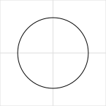
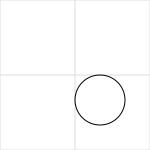
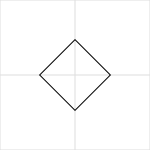
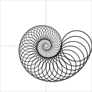

# Joy

Joy is a tiny creative coding library in Python.

## Installation

The easiest way to install it is download `joy.py` and place it in your
directory. The library has no dependencies.

It can be downloaded from:

<https://github.com/fossunited/joy/raw/main/joy.py>

## Coordinate System

Joy uses a canvas with `(0, 0)` as the center of the canvas.

By default, the size of the canvas is `(300, 300)`.

## Using Joy

The `Joy` library integrates well with Jupyter environment and it is
recommended to explore Joy in a Jupyter lab.

The first thing you need to do is import the module.

```python
from joy import *
```

Once the functionality in the module is imported, you can start playing
with it.

## Basic Shapes

Joy supports the basic shapes `Circle`, `Ellipse`, `Rectangle` and `Line`.

Let's start with a drawing a circle:

```
c = Circle()
show(c)
```



By default circle will have center at `(0, 0)` and radius as `100`. But
you can specify different values.

```
c = circle(center=Point(x=50, y=50), radius=50)
show(c)
```



The other basic types that are supported are `Ellipse`, `Rectangle`,
and `Line`:

```
s1 = Circle()
s2 = Ellipse()
s3 = Rectangle()
s4 = Line()
show(s1, s2, s3, s4)
```


## Combining Shapes

Joy supports `+` operator to join shapes.

```
def donut(x, y, r):
    c1 = Circle(center=Point(x=x, y=y), radius=r)
    c2 = Circle(center=Point(x=x, y=y), radius=r/2)
    return c1+c2

d = donut(0, 0, 100)
show(d)
```


## Transformations

Joy supports `Translate`, `Rotate` and `Scale` transformations.
Transformations are applied using `|` operator.

```
shape = Circle(radius=50) | Translate(x=100, y=0)
show(shape)
```


Transformations can be chained too.

```
r1 = Rectangle()
r2 = r1 | Rotate(angle=45) | Scale(1/SQRT2)
show(r1, r2)
```


## Higer-Order Transformations

Joy supports higher-order transformation `Repeat`.

The `Repeat` transformation applies a transformation multiple times and
combines all the resulting shapes.

For example, draw 10 circles:

```
c = Circle(center=Point(x=-100, y=0), radius=50)
shape = c | Repeat(10, Translate(x=10, y=0)
show(shape)
```


Combined with rotation, it can create amusing patterns.

```
shape = Line() | Repeat(18, Rotate(angle=10))
show(shape)
```


We could do the same with a square:

```
shape = Rectangle() | Repeat(18, Rotate(angle=10))
show(shape)
```


or a rectangle:

```
shape = Rectangle(width=200, height=100) | Repeat(18, Rotate(angle=10))
show(shape)
```


We can combine multiple transformations and repeat.

```
shape = Rectangle(width=300, height=300) | Repeat(72, Rotate(360/72) | Scale(0.92))
show(shape)
```


You can try the same with a circle too:

```
c = Circle(center=Point(x=100, y=0), radius=50)
shape = c | Repeat(36*4, Rotate(10) | Scale(0.97))
show(shape)
```


For more information, please checkout the [tutorial](tutorial.ipynb).

## Tutorial

See [tutorial.ipynb](tutorial.ipynb).

## Acknowledgements

Special thanks to Amit Kapoor (@amitkaps). This library woundn't have
been possible without his inputs.

The long discussions between @anandology and @amitkaps on functional
programming and computational artistry (for almost over an year) and the
[initial experiments](https://amitkaps.com/artistry) were some of the
seeds that gave life to this library.

## License

This repository has been released under the MIT License.
